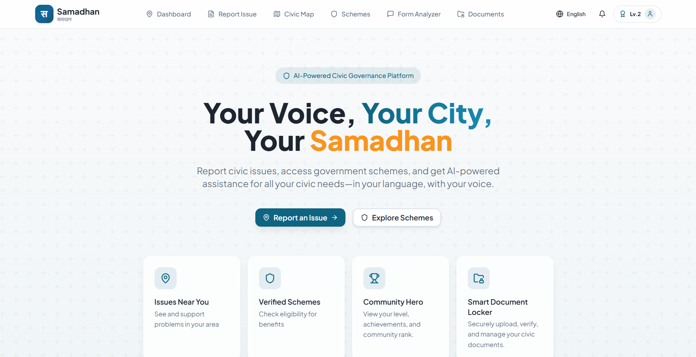

<p align="center">
  
</p>

<h1 align="center">🏛️ Samadhan</h1>

<h3>Empowering Citizens. Enabling Smarter Governance.</h3>

<p>
An AI-powered civic engagement platform that unifies issue reporting, community verification, civic analytics, secure document management, government schemes, and gamified participation — in one connected experience.
</p>

<p>
  
  
  
  
  
  
  
  
  
  
</p>

<p>
  <a href="#-about-samadhan">About</a> •
  <a href="#-key-features">Features</a> •
  <a href="#-system-architecture">Architecture</a> •
  <a href="#%EF%B8%8F-tech-stack">Tech Stack</a> •
  <a href="#-ai-workflow">AI Workflow</a> •
  <a href="#-installation">Installation</a> •
  <a href="#-project-structure">Structure</a> •
  <a href="#-future-scope">Roadmap</a> •
  <a href="#-license">License</a>
</p>

</div>

<br/>

## 📖 About Samadhan

Civic issues — broken roads, overflowing garbage, damaged streetlights, water leaks — are reported every day, but most complaint systems remain slow, opaque, and disconnected from the people they serve. Existing civic-tech tools usually solve only one piece of the problem in isolation: reporting, *or* mapping, *or* document storage.

**Samadhan** brings all of it together. Citizens can report an issue, have it verified by their community, track it on a live map, manage their government documents, check their eligibility for schemes, and earn recognition for civic participation — all inside one connected platform.

**Who it's for:**

| Primary Users | Secondary Users |
|---|---|
| Citizens | Community Volunteers |
| Municipal Authorities | NGOs |
| Government Departments | Smart City Administrators |

**How AI improves the experience:** every report is validated by Vision AI before it reaches a department, duplicate complaints are automatically detected and merged, and authorities receive AI-summarized civic intelligence instead of raw, unstructured complaint data — turning a manual workflow into an automated, trustworthy one.

<br/>

## ✨ Key Features

### 🧠 AI Issue Reporting
**Purpose:** Let citizens report civic issues in seconds using a photo or short video.
**Highlights:** AI-assisted issue categorization · geo-location tagging · complaint lifecycle tracking
**Benefits:** Faster reporting with minimal manual effort

### 🎥 Video Upload with Local Frame Extraction
**Purpose:** Support richer evidence without compromising privacy or storage cost.
**Highlights:** A representative frame is extracted **locally in-browser**; the original video is discarded immediately and never uploaded or stored — only the extracted frame enters the AI pipeline.
**Benefits:** Privacy-first reporting with zero video storage overhead

### 🔍 AI Issue Classification
**Purpose:** Automatically understand what an issue is and where it should go.
**Highlights:** Vision-based categorization · department recommendation
**Benefits:** Removes manual triage for both citizens and authorities

### 🧬 Duplicate Detection
**Purpose:** Prevent the same issue from being reported repeatedly.
**Highlights:** AI-powered duplicate complaint detection across existing reports
**Benefits:** Less administrative noise, cleaner data for authorities

### 🤝 Community Verification
**Purpose:** Make every complaint trustworthy through peer validation.
**Highlights:** Support/disagree voting (one vote per user) · community confidence score · "Community Verified" badge · interactive issue timeline · real-time updates
**Benefits:** Filters out false reports and builds public trust before authorities act

### 📊 Civic Dashboard

<p align="center">
  
</p>
<p align="center"><sub><b>AI classifications, duplicate prevention, resolution time, and live category/status breakdowns — all in one dashboard.</b></sub></p>

**Purpose:** Give citizens and authorities a real-time pulse on civic activity.
**Highlights:** AI classification stats, duplicate-prevention counters, average resolution time, geo-tagged report coverage, category and status distribution
**Benefits:** Instant visibility into what's happening and what's improving

### 📈 Analytics
**Purpose:** Convert raw complaint data into decisions authorities can act on.
**Highlights:** Weekly AI civic summaries · department performance leaderboard · resolution analytics · risk hotspot analysis · issue density metrics · resolution forecasting · AI recommendations
**Benefits:** Data-driven governance and measurable departmental accountability

### 🗺️ Interactive Civic Map

<p align="center">
  
</p>
<p align="center"><sub><b>Live, filterable map of reported issues with category breakdowns and top-affected-city rankings.</b></sub></p>

**Purpose:** Visualize civic issues spatially, citywide.
**Highlights:** Live map markers · category and status filtering · popup details · verified badges · navigation support
**Benefits:** Instant hotspot visibility and faster prioritization for authorities

### 📁 Smart Document Locker

<p align="center">
  
</p>
<p align="center"><sub><b>AI-validated, OCR-processed document storage with readiness insights and expiry tracking.</b></sub></p>

**Purpose:** Give citizens one secure home for important government documents.
**Highlights:** AI document validation · OCR extraction · AI-generated summaries · Trust Score · expiry monitoring · smart search · preview dialog · upload progress tracking
**Benefits:** No missed renewals and instant access when documents are needed

### 🏛️ Government Schemes
**Purpose:** Help citizens evaluate their readiness for relevant government schemes.
**Highlights:** Readiness score · required document matching · missing document identification · direct attachment from the Locker · progress indicators
**Benefits:** Faster applications and higher scheme awareness

### 🏆 Community Hero
**Purpose:** Turn civic participation into a rewarding, long-term habit.
**Highlights:** XP system · level progression · citizen ranks · achievement badges · weekly contribution streaks · community leaderboard · navbar widget · achievement notifications
**Benefits:** Sustained engagement and a stronger sense of civic identity

### 📝 AI Form Analyzer
**Purpose:** Help citizens understand and act on government forms.
**Highlights:** AI-assisted form analysis as part of the broader document and scheme workflow
**Benefits:** Reduces friction when dealing with government paperwork

<br/>

## 🧩 System Architecture

```
Frontend (React · TypeScript · Vite · Tailwind CSS)
        │
        ▼
   Supabase Backend
        │
        ▼
Authentication → Database → Storage → Edge Functions
        │
        ▼
   AI Services Layer
        │
        ▼
 Analytics & Dashboard Layer
```

> 🖼️ `[Insert System Architecture Diagram]`

<br/>

## ⚙️ AI Workflow

```
Image / Video Upload
        │
        ▼
Video Frame Extraction   (local, in-browser — original video discarded)
        │
        ▼
     Vision AI
        │
        ▼
Issue Classification
        │
        ▼
Duplicate Detection
        │
        ▼
Department Recommendation
        │
        ▼
Community Verification
        │
        ▼
Resolution Tracking
```

> 🔒 **Privacy by design:** videos are never uploaded or stored. Only a single AI-processed frame, extracted locally in the browser, ever enters the pipeline.

> 🖼️ `[Insert AI Workflow Diagram]`

<br/>

## 📄 Document Workflow

```
Document Upload
        │
        ▼
  AI Validation
        │
        ▼
      OCR
        │
        ▼
   Metadata
        │
        ▼
   Summary
        │
        ▼
    Locker
        │
        ▼
Government Scheme Matching
```

> 🖼️ `[Insert Document Workflow Diagram]`

<br/>

## 🛠️ Tech Stack

**Google Technologies**

| Google Technology | Role in Project |
|---|---|
| Google AI Studio | Development and experimentation |
| Firebase (Google Cloud) | Current deployment |

**Frontend**

| Technology | Purpose |
|---|---|
| React | Component-driven UI |
| TypeScript | Type safety across the codebase |
| Vite | Fast builds and hot module reload |
| Tailwind CSS | Utility-first styling |

**UI**

| Technology | Purpose |
|---|---|
| shadcn/ui | Accessible, production-grade components |
| React Hook Form | Form state and validation |

**Charts & Maps**

| Technology | Purpose |
|---|---|
| Recharts | Analytics charts and dashboards |
| Leaflet | Interactive civic map rendering |
| OpenStreetMap | Open geospatial map data |

**Backend**

| Technology | Purpose |
|---|---|
| Supabase | Unified backend-as-a-service |
| Edge Functions | Serverless logic for AI pipelines and workflows |

**Database**

| Technology | Purpose |
|---|---|
| PostgreSQL | Relational storage for structured civic data |

**Authentication**

| Technology | Purpose |
|---|---|
| Supabase Authentication | Citizen and authority login |

**Storage**

| Technology | Purpose |
|---|---|
| Supabase Storage | Secure document and media storage |

**AI**

| Technology | Purpose |
|---|---|
| Roboflow Vision | Computer vision for issue/frame analysis |
| OCR Pipeline | Text extraction from uploaded documents |
| Google AI Studio | Development and experimentation |

<br/>

## 🚀 Installation

```bash
# 1. Clone the repository
git clone https://github.com/your-username/samadhan.git
cd samadhan

# 2. Install dependencies
npm install

# 3. Set up environment variables
cp .env.example .env
# Fill in the values — see Environment Variables section below

# 4. Run the development server
npm run dev

# 5. Build for production
npm run build

# 6. Preview the production build locally
npm run preview
```

**Deployment**

```bash
# Firebase Hosting
firebase deploy

# Google Cloud (final submission target)
gcloud app deploy
```

<br/>

## 🔑 Environment Variables

Create a `.env` file in the project root:

```env
VITE_SUPABASE_URL=
VITE_SUPABASE_ANON_KEY=
GOOGLE_AI_API_KEY=
```

> ⚠️ Never commit real API keys. Use `.env.example` as a template and keep `.env` in `.gitignore`.

<br/>

## 📂 Project Structure

```
samadhan/
├── public/
├── src/
│   ├── assets/
│   ├── components/
│   │   ├── ui/
│   │   ├── reporting/
│   │   ├── verification/
│   │   ├── map/
│   │   ├── analytics/
│   │   ├── documents/
│   │   ├── schemes/
│   │   └── community-hero/
│   ├── pages/
│   ├── hooks/
│   ├── lib/
│   ├── services/
│   │   ├── ai/
│   │   └── supabase/
│   ├── types/
│   ├── App.tsx
│   └── main.tsx
├── supabase/
│   └── functions/          # Edge Functions
├── .env.example
├── package.json
├── tailwind.config.ts
├── vite.config.ts
└── README.md
```

<br/>

## 🔮 Future Scope

- 📱 Native Mobile App
- 🌐 IoT Integration for real-time civic sensing
- 🤖 Advanced Predictive Analytics
- 🏛️ Government API Integration
- 🗣️ Multilingual AI Assistant
- 🏙️ Smart City Dashboard for municipal oversight

<br/>

## 🤝 Contributing

Contributions are welcome!

1. Fork the repository
2. Create a feature branch (`git checkout -b feature/amazing-feature`)
3. Commit your changes (`git commit -m 'Add amazing feature'`)
4. Push to the branch (`git push origin feature/amazing-feature`)
5. Open a Pull Request

Please ensure your code follows the existing style and includes relevant tests where applicable.

<br/>

## 📜 License

Distributed under the **MIT License**. See `LICENSE` for more information.

<br/>

## 🙏 Acknowledgements

- Google AI Hackathon
- The Open Source Community
- [React](https://react.dev)
- [Supabase](https://supabase.com)
- [Leaflet](https://leafletjs.com)
- [Roboflow](https://roboflow.com)

<br/>

<div align="center">

**Built by [Divyanshu Kubde](https://github.com/your-username)**

⭐ If you found this project interesting, consider starring the repo!

</div>
